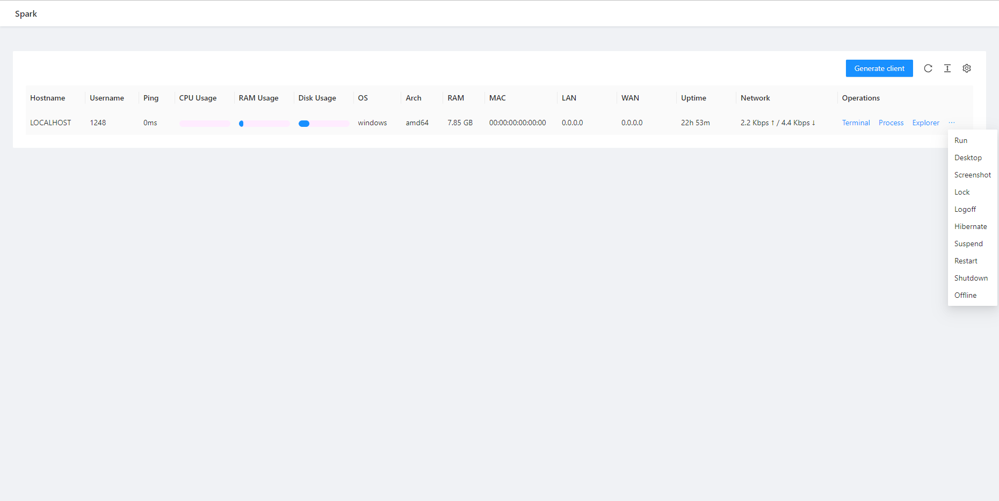
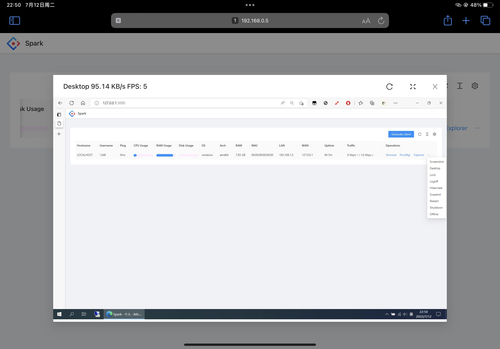
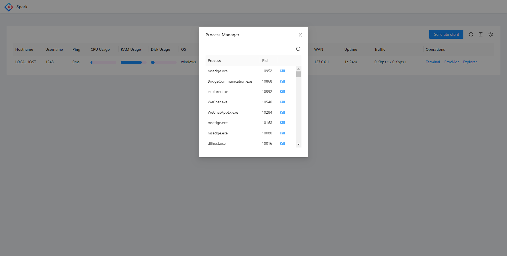
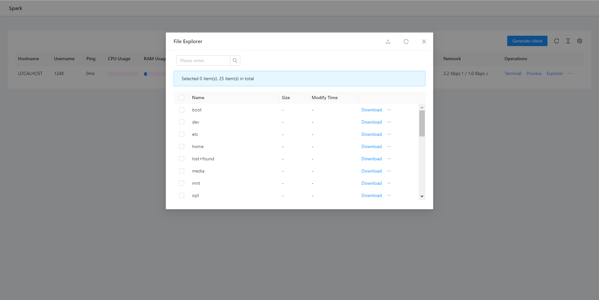
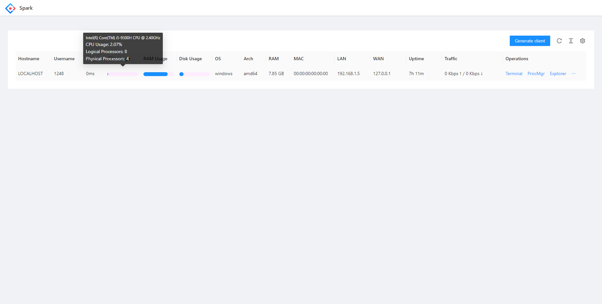
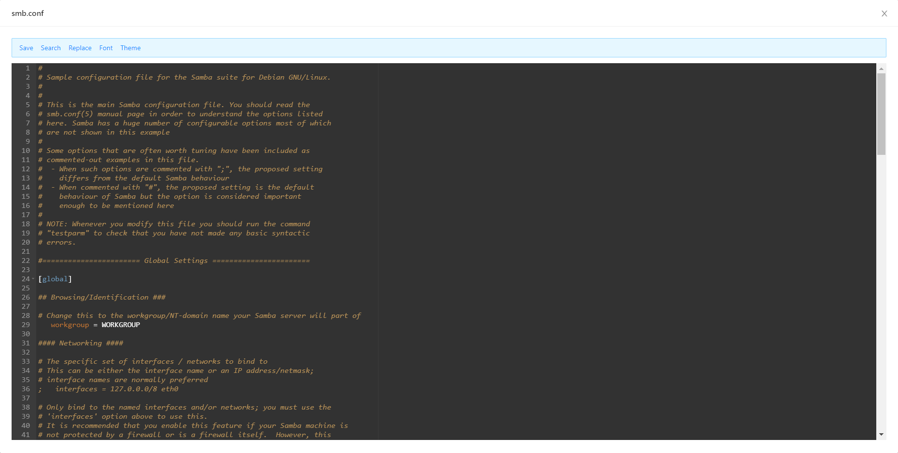

#### [English] [[中文]](./README.ZH.md) [[API Document]](./API.md) [[API文档]](./API.ZH.md)

---

<h1>Spark</h1>

**[Spark](https://github.com/XZB-1248/Spark)** is a free, safe, open-source, web-based, cross-platform, and full-featured RAT (Remote Administration Tool) that allows you to control all your devices via browser anywhere.

✅ **No data collection**: Spark does not collect any user information.  
✅ **No auto-updates**: The server will not update itself.  
✅ **Direct communication**: Clients communicate exclusively with your server.

---


|  |  |  |
|-----------------------------------------------------------------------------------------------|-----------------------------------------------------------------------------------------|-------------------------------------------------------------------------------------------------------|

| [](https://github.com/XZB-1248/Spark/releases) | [](https://github.com/XZB-1248/Spark/releases/latest) |
|---------------------------------------------------------------------------------------------------------------------------------------------------|--------------------------------------------------------------------------------------------------------------------------------------------------------------------------------|

--

---

## 🚀 Quick Start

### Binary Execution

1. Download the executable from the [releases](https://github.com/XZB-1248/Spark/releases) page.
2. Follow the [Configuration](#configuration) instructions.
3. Run the executable and access the web interface at `http://IP:Port`.
4. Generate a client and run it on the target device.
5. Start managing your devices!

---

## ⚙️ Configuration

The configuration file `config.json` should be in the same directory as the executable.

**Example:**

```json
{
    "listen": ":8000",
    "salt": "123456abcdef123456", 
    "auth": {
        "username": "password"
    },
    "log": {
        "level": "info",
        "path": "./logs",
        "days": 7
    }
}
```

### Main Parameters:
- **`listen`** (required): Format `IP:Port`.
- **`salt`** (required): Max length 24 characters. After modification, all clients need to be regenerated.
- **`auth`** (optional): Authentication credentials (`username:password`).
  - Hashed passwords are recommended (`$algorithm$hashed-password`).
  - Supported algorithms: `sha256`, `sha512`, `bcrypt`.
- **`log`** (optional): Logging configuration.
  - `level`: `disable`, `fatal`, `error`, `warn`, `info`, `debug`.
  - `path`: Log directory (default: `./logs`).
  - `days`: Log retention days (default: `7`).

---

## 🛠️ Features

| Feature/OS        | Windows | Linux | MacOS |
|-------------------|---------|-------|-------|
| Process Manager   | ✔       | ✔     | ✔     |
| Kill Process      | ✔       | ✔     | ✔     |
| Network Traffic   | ✔       | ✔     | ✔     |
| File Explorer     | ✔       | ✔     | ✔     |
| File Transfer     | ✔       | ✔     | ✔     |
| File Editor       | ✔       | ✔     | ✔     |
| Delete File       | ✔       | ✔     | ✔     |
| Code Highlighting | ✔       | ✔     | ✔     |
| Desktop Monitor   | ✔       | ✔     | ✔     |
| Screenshot        | ✔       | ✔     | ✔     |
| OS Info           | ✔       | ✔     | ✔     |
| Remote Terminal   | ✔       | ✔     | ✔     |
| * Shutdown        | ✔       | ✔     | ✔     |
| * Reboot          | ✔       | ✔     | ✔     |
| * Log Off         | ✔       | ❌     | ✔     |
| * Sleep           | ✔       | ❌     | ✔     |
| * Hibernate       | ✔       | ❌     | ❌     |
| * Lock Screen     | ✔       | ❌     | ❌     |

🚨 **Functions marked with * may require administrator/root privileges.**

---

## 📸 Screenshots

  
  
  
  
  
  


---

## 🔧 Development

### Components
This project consists of three main components:
- **Client**
- **Server**
- **Front-end**

For OS support beyond Linux and Windows, additional C compilers may be required. For example, to support Android, install [Android NDK](https://developer.android.com/ndk/downloads).

### Build Guide

```bash
# Clone the repository
git clone https://github.com/XZB-1248/Spark
cd ./Spark

# Build the front-end
cd ./web
npm install
npm run build-prod

# Embed static resources
cd ..
go install github.com/rakyll/statik
statik -m -src="./web/dist" -f -dest="./server/embed" -p web -ns web

# Build the client
mkdir ./built
go mod tidy
go mod download
./scripts/build.client.sh

# Build the server
mkdir ./releases
./scripts/build.server.sh
```

## Custom Features

If you need to customize some features, please contact me via [**i@1248.ink**](mailto:i@1248.ink).

---

## Dependencies

Spark contains many third-party open-source projects.

Lists of dependencies can be found at `go.mod` and `package.json`.

Some major dependencies are listed below.

### Back-end

* [Go](https://github.com/golang/go) ([License](https://github.com/golang/go/blob/master/LICENSE))

* [gin-gonic/gin](https://github.com/gin-gonic/gin) (MIT License)

* [imroc/req](https://github.com/imroc/req) (MIT License)

* [kbinani/screenshot](https://github.com/kbinani/screenshot) (MIT License)

* [shirou/gopsutil](https://github.com/shirou/gopsutil) ([License](https://github.com/shirou/gopsutil/blob/master/LICENSE))

* [gorilla/websocket](https://github.com/gorilla/websocket) (BSD-2-Clause License)

* [orcaman/concurrent-map](https://github.com/orcaman/concurrent-map) (MIT License)

### Front-end

* [React](https://github.com/facebook/react) (MIT License)

* [Ant-Design](https://github.com/ant-design/ant-design) (MIT License)

* [axios](https://github.com/axios/axios) (MIT License)

* [xterm.js](https://github.com/xtermjs/xterm.js) (MIT License)

* [crypto-js](https://github.com/brix/crypto-js) (MIT License)

### Acknowledgements

* [natpass](https://github.com/lwch/natpass) (MIT License)
* Image difference algorithm inspired by natpass.

[](https://dartnode.com "Powered by DartNode - Free VPS for Open Source")

---

### Stargazers over time

[](https://starchart.cc/XZB-1248/Spark)


---

## 📜 License

Distributed under the [BSD-2 License](./LICENSE).
